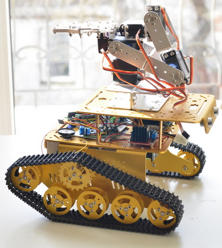
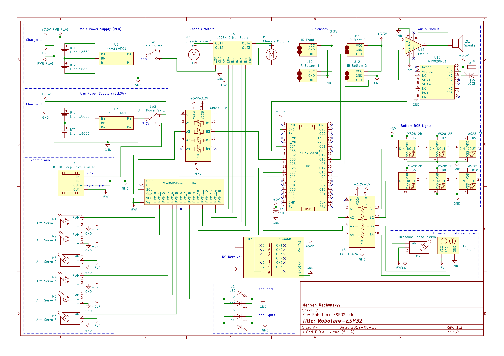

# RoboTank-ESP32

<table>
  <tr>
    <td>This is a source code and schematics for the ESP32-based robot with the 6-servos manipulator.</td>
<td>

</td>
  </tr>
</table>

## Used Components

  * [ESP32 DevBoard](https://www.banggood.com/ESP32-Development-Board-WiFibluetooth-Ultra-Low-Power-Consumption-Dual-Cores-ESP-32-ESP-32S-Board-p-1109512.html?p=M908156347868201609Y)
  * [Geekcreit DT300 WIFI Double Decker Tank Chassis](https://www.banggood.com/DT300-WIFI-Double-Layer-Decker-Tracked-Model-Robot-Tank-DIY-Kit-Compatible-With-Arduino-UNO-R3-p-1079947.html?p=M908156347868201609Y)
  * [L298N Dual H Bridge Motor Driver](https://www.banggood.com/Wholesale-L298N-Dual-H-Bridge-Stepper-Motor-Driver-Board-p-42826.html?p=M908156347868201609Y)
  * [PCA9685 16-Channel 12-bit PWM Extender I2C](https://www.banggood.com/PCA9685-16-Channel-12-bit-PWM-Servo-Motor-Driver-I2C-Module-p-1170343.html?p=M908156347868201609Y)
  * [6-DOF Robotic Arm](https://www.banggood.com/ROT2U-6DOF-Silver-Aluminium-Robot-Arm-Clamp-Claw-Mount-Kit-With-Servos-p-1118027.html?p=M908156347868201609Y) - please note, we had to replace two of the original MG996R servos with stronger ones (see below)
  * [SPT Servo SPT5535LV-320 35KG 320°](https://www.banggood.com/SPT-Servo-SPT5535LV-320-35KG-Large-Torque-Metal-Gear-Digital-Servo-For-RC-Robot-RC-Robot-Arm-p-1577513.html?p=M908156347868201609Y)
  * [SPT Servo SPT5525LV-320 25KG 320°](https://www.banggood.com/SPT-Servo-SPT5525LV-320-25KG-Digital-Servo-320-Metal-Gear-Large-Torque-Servo-For-RC-Robot-p-1383203.html?p=M908156347868201609Y)
  * [Ultrasonic distance sensor HC-SR04 with the servo-mounting cradle](https://www.banggood.com/Wholesale-Geekcreit-Ultrasonic-Module-HC-SR04-Distance-Measuring-Ranging-Transducer-Sensor-DC-5V-2-450cm-p-40313.html?p=M908156347868201609Y) 
  * [TowerPro SG90 Mini Gear Micro Servo 9g](http://www.banggood.com/TowerPro-SG90-Mini-Gear-Micro-Servo-9g-For-RC-Airplane-Helicopter-p-1009914.html?p=M908156347868201609Y)
  * [Infrared Obstacle Detectors](https://www.banggood.com/5Pcs-Infrared-Obstacle-Avoidance-Sensor-Smart-Car-Robot-p-951032.html?p=M908156347868201609Y) - 4x
  * [LED Lights caps](https://www.banggood.com/3mm5mm8mm10mm-Lightcup-5Pcs-For-RC-Car-LED-Lights-p-930752.html?p=M908156347868201609Y)
  * [WS2812B SMD LED boards](https://www.banggood.com/10Pcs-DC-5V-3MM-x-10MM-WS2812B-SMD-LED-Board-Built-in-IC-WS2812-p-958213.html?p=M908156347868201609Y)
  * [Logical Level Converter TXB0104 4-Bit](https://www.banggood.com/CJMCU-401-TXB0104-4-Bit-Bidirectional-Voltage-Level-Translator-Auto-Direction-Sensing-ESD-Protection-p-1149178.html?p=M908156347868201609Y) - 2x
  * [Sound module WTV020-SD with Mini SD Card](https://www.banggood.com/WTV020-WTV020-SD-Mini-SD-Card-MP3-Sound-Module-For-PIC-WTV020-SD-16P-p-1540568.html?p=M908156347868201609Y)
  * [LM386 Audio Amplifier](https://www.banggood.com/LM386-Module-20-Times-Gain-Audio-Amplifier-Module-With-Adjustable-Resistance-p-1111643.html?p=M908156347868201609Y)
  * [Flysky 2.4G 6CH FS-iA6B Receiver](https://www.banggood.com/Flysky-2_4G-6CH-FS-iA6B-Receiver-PPM-Output-With-iBus-Port-p-978603.html?p=M908156347868201609Y) - can be used with a RC transmitter like [FlySky FS-i6 2.4G 6CH](https://www.banggood.com/FlySky-FS-i6-2_4G-6CH-AFHDS-RC-Radion-Transmitter-With-FS-iA6B-Receiver-for-RC-FPV-Drone-p-983537.html?p=M908156347868201609Y)
  * [DC-DC Step Down Power Converter](https://www.banggood.com/DC-DC-CC-CV-Buck-Converter-Board-Step-Down-Power-Supply-Module-7-32V-to-0_8-28V-12A-p-1245047.html?p=M908156347868201609Y)
  * [Battery Management System 2S 7.4V 8A Peak Current 15A for 18650 Lithium Battery](https://www.banggood.com/2S-7_4V-8A-Peak-Current-15A-18650-Lithium-Battery-Protection-Board-With-Over-Charge-Protection-p-1259709.html?p=M908156347868201609Y) - 2x
  * [18650 Li-Ion Elements](https://www.banggood.com/4Pcs-INR18650-30Q-3000mAh-20A-Discharge-Current-18650-Power-Battery-Unprotected-Button-Top-18650-Battery-For-Flashlights-E-Cig-Tools-p-1067185.html?p=M908156347868201609Y) - 4x, make sure you've got at least 20A rated max output. Arm servos can be very power-hungry.

## ESP IDF Requirements

This project relies on the features introduced in ESP IDF version 4.1. Make sure you use at least this version.

## Schematics

## Robot's Web Page and OTA

Right after booting, the robot tries to connect to the local WiFi network. Connection parameters can be specified in "OTA WiFi Configuration" in make menuconfig.  

Having a connection started, robot launches own Web Server. You can find the IP address of the robot in your WiFi router settings pages (making it static can be a good idea). 

Direct your web browser to the robot's IP address and a home page will be shown. You can upload new firmware updates there (so you don't need to connect your robot with the USB wire any more). Also you can see the log messges output right on the web page (this feature will work if LOG_USE_WEB_FRONTEND is defined in RoboTank-ESP32.cpp). 

## On-board sounds

Place the files from sdcard folder to the root of the sound module SD card.

Tracks are the following:
  * 0000.AD4 - Thinking
  * 0001.AD4 - Working
  * 0002.AD4 - Talking
  * 0003.AD4 - Hello
  * 0004.AD4 - Scared
  * 0005.AD4 - Be careful
  * 0006.AD4 - Vivaldi - Winter

Files were converted from the original MP3's as described here: https://www.buildcircuit.com/how-to-convert-mp3-and-wav-files-to-ad4-format-wtv020sd-tutorial/